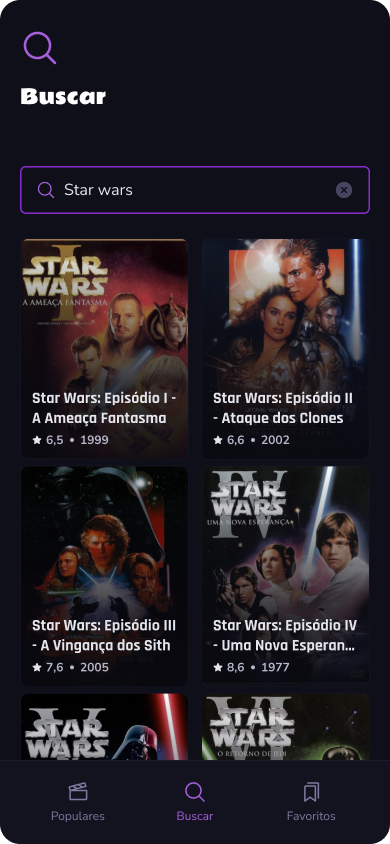

# 📱 Movie App

Bem-vindo ao repositório do Movie App. Usei esse projeto para aprimorar e consolidar os conceitos práticos utilizados no mercado de trabalho, desde o básico até avançado, tudo isso construindo um App utilizando API [Themoviedb](https://www.themoviedb.org/), focando em arquitetura, **Domain Drive Design**, MVVM, Expo Router e **Typescript** 

|                               |                               |                               |                               |
| :---------------------------: | :---------------------------: | :---------------------------: | :---------------------------: |
|  |  |  |  |
|  |  |

Confira o Figma completo com todas as tela [aqui](https://www.figma.com/community/file/1509971053495906327)!

## ⛏️ Tech (Bibliotecas e Tecnologias)

- [React Native](https://reactnative.dev/docs/getting-started-without-a-framework)
- [TypeScript](https://www.typescriptlang.org/)
- [Zustand](https://zustand.docs.pmnd.rs/getting-started/introduction)
- [TanStack Query (React Query)](https://tanstack.com/query/latest)
- [Shopify Restyle](https://shopify.github.io/restyle/)

## 🏗️ Arquitetura do Projeto

O Movie App adota uma arquitetura em camadas com princípios de Clean Architecture, SOLID, design patterns e MVVM (Model-View-ViewModel). Esta estrutura, validada em projetos com milhares de usuários, visa criar apps fáceis de entender e manter, além de escaláveis em termos de base de código e equipe.

## 👨🏻‍💻 Quem sou eu?

**David Rappa** é um especialista em React Native com **mais de 5 anos de experiência** pratica no desenvolvimento de aplicativos de alto desempenho para empresas no **Brasil**. Atualmente trabalhando como **engenheiro de software pleno** em uma empresa de e-commerce no Brasil.

- [LinkedIn](https://www.linkedin.com/in/davidrappa1/)
- [GitHub](https://github.com/davidrappa)
- [Instagram](https://www.instagram.com/dvdrpp/)